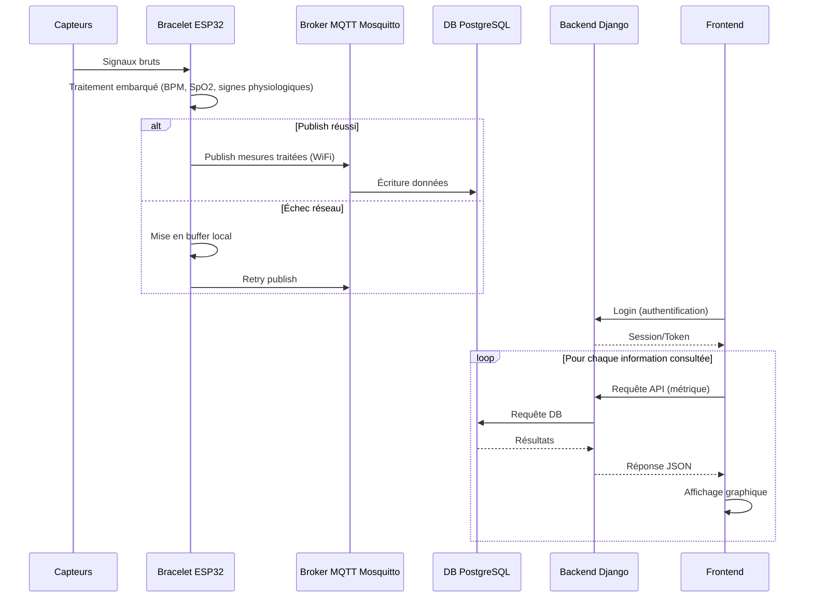

# Documentation — Bracelet Connecté Open Source

**PDG 2026**

**Groupe 9 :**

**R. Bouzourène, L. Haye, D. Kury & T. Nguyen**

**Date :** 23 juillet 2026

---

## 1. Description du produit

### Qu'est-ce que c'est

Un bracelet connecté sans écran, porté au poignet, qui mesure en continu des signaux physiologiques et d'activité de son porteur : rythme cardiaque, oxymétrie (SpO2) et nombre de pas. Le bracelet ne fait qu'acquérir et transmettre les données — toute la visualisation se fait sur une webapp accessible depuis un navigateur.

Le produit se compose de deux parties :
- **Le bracelet** (matériel) : capte les signaux bruts, les traite et les envoie en Wi-Fi.
- **La webapp** (logiciel) : reçoit les données, les stocke, et les affiche à l'utilisateur sous forme de courbes et d'historique.

### À qui s'adresse-t-il

Toute personne souhaitant suivre ses constantes physiologiques au quotidien (sportifs, curieux, profil "quantified self"), sans dépendre d'un matériel propriétaire fermé ni d'un abonnement payant pour accéder à ses propres données.

### Ce que le produit fait concrètement

- Il se porte au poignet en continu, sans nécessiter d'action de l'utilisateur (pas de bouton à presser pour lancer une mesure).
- Il mesure en permanence le rythme cardiaque et la saturation en oxygène du sang via un capteur optique posé contre la peau.
- Il détecte les mouvements du poignet pour compter les pas.
- Il envoie ces données par Wi-Fi, à intervalle régulier (quelques secondes), vers un serveur.
- L'utilisateur se connecte à la webapp pour voir, en direct ou en différé, son rythme cardiaque, sa saturation en oxygène et son nombre de pas, ainsi que l'historique de ces mesures.
- L'utilisateur garde la main sur ses données : il peut les consulter, les exporter, ou les supprimer.

### Ce que le produit ne fait pas

- Ce n'est pas un dispositif médical : il ne diagnostique, ne surveille ni ne traite aucune pathologie. Les valeurs affichées sont indicatives, pas des données de suivi clinique.
- Il n'a pas d'écran ni d'interface physique — toute interaction se fait via la webapp.
- Dans une première version, il ne calcule pas de scores complexes (récupération, stress) : il affiche les mesures brutes/traitées (BPM, SpO2, pas).

---

## 2. Composition du bracelet

| Composant | Fonction dans le produit |
|-----------|---------------------------|
| **XIAO ESP32S3** | Cerveau du bracelet : lit les capteurs, traite le signal, envoie les données en Wi-Fi |
| **SEN0344 (DFRobot)** | Capteur optique posé contre la peau du poignet, mesure le rythme cardiaque **et** l'oxymétrie (SpO2) |
| **SEN0142 (DFRobot)** | Accéléromètre, détecte les mouvements du poignet pour le comptage de pas |

Le bracelet fonctionne en continu, alimenté par batterie, et communique uniquement en Wi-Fi (pas de Bluetooth dans cette version).


> **Note sur le choix de connectivité :** le Wi-Fi a été retenu pour cette version afin de simplifier l'intégration avec le broker et la webapp. Cependant, pour un usage réel en tant que bracelet porté au quotidien, le BLE (Bluetooth Low Energy) serait un choix plus adapté : il consomme beaucoup moins d'énergie que le Wi-Fi, ce qui permettrait d'augmenter significativement l'autonomie de la batterie — un critère essentiel pour un dispositif porté en continu. Le passage au BLE (avec un relais/passerelle vers le serveur) est envisagé comme une évolution possible du produit une fois le prototype Wi-Fi validé. Le choix d'utiliser le Wi-Fi plutôt que la technologie BLE à été fait en raison de la limitation dans le temps de notre projet. Utiliser le BLE aurait demandé un temps de développement d'une app android assez considérable en vue du projet.

---

## 3. Fonctionnement du produit, étape par étape

1. **Le capteur cardiaque et d'oxymétrie (SEN0344)** est en contact avec la peau et utilise deux longueurs d'onde de lumière (rouge et infrarouge). Le sang oxygéné et désoxygéné n'absorbe pas la lumière de la même manière : le rapport entre les deux signaux permet d'estimer la saturation en oxygène (SpO2). La variation du signal réfléchi permet également de détecter chaque battement de cœur.

2. **L'accéléromètre (SEN0142)** détecte les mouvements du bras, ce qui permet de compter les pas et d'aider à distinguer un vrai battement de cœur d'un artefact dû au mouvement.

3. **La carte ESP32S3** récupère ces données brutes, fait un premier nettoyage/traitement (le signal cardiaque brut est bruité), calcule le rythme cardiaque (BPM) et la SpO2, et envoie régulièrement (toutes les 1 à 5 secondes) ce paquet de données vers un serveur via Wi-Fi.

4. **Le serveur** reçoit les données, les enregistre en base, et les met à disposition de la webapp.

5. **La webapp** affiche à l'utilisateur, en quasi temps réel, son rythme cardiaque, son oxymétrie et son nombre de pas, avec la possibilité de consulter l'historique.

---

## 4. Fonctionnalités du produit

### Requirements fonctionnels

- Captation continue des données brutes via le capteur PPG.
- Transmission périodique et fiable des mesures vers le serveur.
- Visualisation des données et de l’historique sur la webapp.
- Contrôle utilisateur des données: consultation, export, suppression, consentement.

### Requirements non-fonctionnels

- Performance: latence cible inférieure à 5 s entre mesure et affichage.
- Fiabilité: tolérance aux pertes réseau ponctuelles.
- Sécurité: chiffrement et séparation des données sensibles.
- Confidentialité: minimisation des données et traitement local quand possible.
- Open source: matériel, logiciel et données ouverts et portables.

---

## 5. Diagramme de séquence



## 6. Problématique
Le projet doit résoudre plusieurs contraintes en même temps. Il faut assurer une communication fiable entre le matériel et le serveur, malgré les limitations des composants embarqués. Il faut aussi garantir la protection des données, notamment vis-à-vis du RGPD, tout en permettant un accès simple au site web et à la visualisation des données.

Un autre enjeu important concerne l’appairage entre le bracelet et le compte utilisateur. Enfin, les données physiologiques doivent être accessibles avec une latence réduite afin de rester utiles pour le suivi.


## 7. Solution proposée

La solution retenue repose sur une communication Wi-Fi entre le bracelet et le broker afin d’acheminer les données de manière régulière. Une librairie embarquée traite une partie des mesures localement pour réduire le volume de données envoyées et limiter la fréquence des transmissions.

La chaîne de communication est sécurisée et les données sont pseudo-anonymisées. Une webapp, composée d’un backend et d’un frontend, permet ensuite la consultation et la visualisation. Chaque firmware possède également un identifiant unique pour faciliter l’appairage. Une latence de quelques secondes reste acceptable dans ce contexte.

Les choix techniques s’orientent vers un firmware basé pour ESP32, les librairies de traitement embarqués sur esp32, ainsi que le framework Arduino avec PlatformIO.

L’infrastructure repose sur une instance broker, un backend en Django et un frontend à définir. Le projet utilise GitHub et GitHub Actions pour l’intégration continue, Docker pour conteneuriser les services et PostgreSQL pour la base de données.

Enfin, le protocole de communication entre l’ESP32 et le broker est MQTTS.


## 8. Ce que voit et peut faire l'utilisateur (webapp)

- Se connecter à son compte.
- Voir en direct son rythme cardiaque et son oxymétrie (et les métriques additionnelles si implémentées).
- Consulter l'historique de ses mesures dans le temps.
- Exporter ses données.
- Supprimer ses données à tout moment.


## 9. Collaboration de l'équipe

Le dépôt Github est organisé par domaine fonctionnel.

- `firmware/` : code embarqué du bracelet.
- `test`
- `broker` : repos infra-broker
- `db`: base de données, repos infra-db

### Stratégie de branches

La branche `main` doit rester propre.Chaque nouvelle fonctionnalité passe la création d'une nouvelle branche avant PR. Toute modification passe donc par une pull request et une validation minimale avant fusion. Les branches main ne peuvent pas être protégée sur la version gratuite de Github. La règle est de toujours passer par une PR.

### CI/CD

La CI doit vérifier automatiquement un push sur `main` ou sur les pull requests.

- vérification du build;
- exécution des tests automatisés quand ils existent;
- validation manuelle du matériel pour ce qui ne peut pas être testé automatiquement (test matériel)
- lors d'un tag v* (convention de nomage des tags : `Majeur`.`mineur`.`patch`, exemple : 3.5.6), une release automatique est faite
  - docker: lors du CD, une image du docker est push sur la gitlab docker registry.
  - firmware : lors du CI une release est faite avec le binaire du firmware (CD fait à la main cf. chapitre processus de développement/firmware)

### Procésus de développement

#### software (DB, Broker, WebApp)
Mode agile avec tableau Kanban à la racine de l'organisation. Création d'issues dans les repos qu'on associe à des Merge Requests et qu'on ajoute dans le tableau Kanban avec les différentes étapes : `Backlog`/`Ready`/`In Progress`/`In Review`/`Done`.

#### firmware
Processus de développement waterfall (planifié) pour les choix hardware
Processus agile pour le développement du firmware et utilisation du Kanban présenté au chapitre ci-dessus.

Le développement firmware se fait avec l'extension PlatformIO de VSCode.

Pour compiler et déverser le firmware sur le esp32 :
```bash
pio test -e native # test unitaire
pio check -e esp32-s3 # build
pio run -e esp32-s3 --target upload --target monitor # run local
```