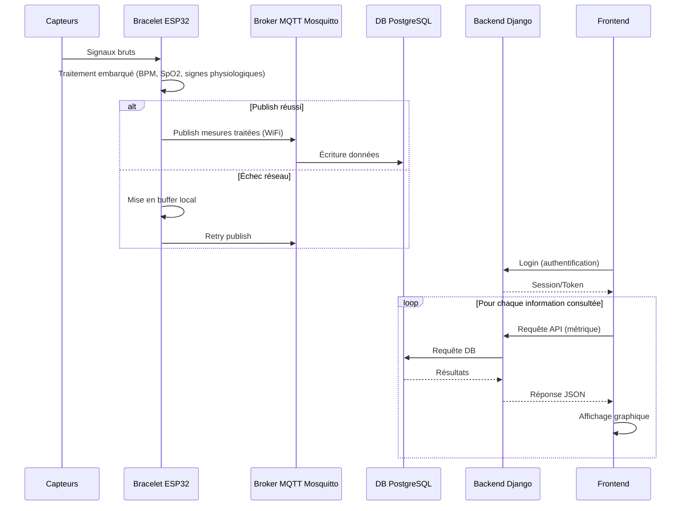
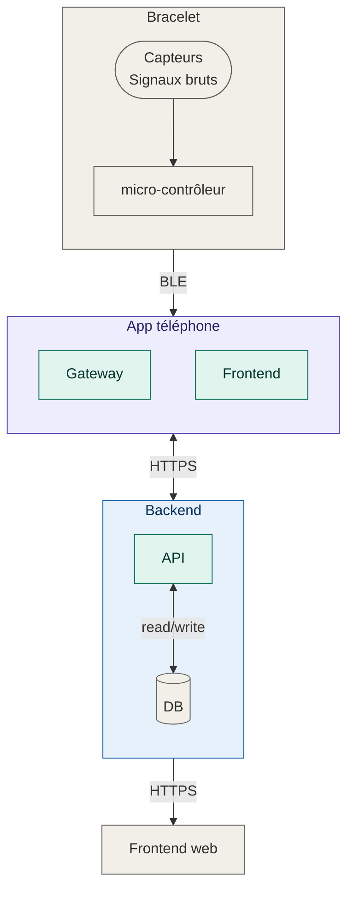

# Documentation — Bracelet Connecté Open Source

**PDG 2026**

**Groupe 9 :**

**R. Bouzourène, L. Haye, D. Kury & T. Nguyen**

**Date :** 23 juillet 2026

---

## 1. Description du produit

### Qu'est-ce que c'est

Un bracelet connecté sans écran, porté au poignet, qui mesure en continu des signaux physiologiques et d'activité de son porteur : battements par minute, oxymétrie (SpO2) et nombre de pas. Le bracelet ne fait qu'acquérir, traiter et transmettre les données. Toute la visualisation se fait sur l'app ou la webapp accessible depuis un navigateur.

Le produit se compose de deux parties :
- **Le bracelet** : capte les signaux bruts, les traite et les envoie en Wi-Fi.
- **L'app et la webapp** : reçoit les données, les stocke et les affiche à l'utilisateur sous forme de courbes et d'historique.

### À qui s'adresse-t-il

Toute personne souhaitant suivre ses constantes physiologiques au quotidien (sportifs, curieux, profil "quantified self"), sans dépendre d'un matériel propriétaire fermé ni d'un abonnement payant pour accéder à ses propres données.

### Ce que le produit fait concrètement

- Il se porte au poignet en continu, sans nécessiter d'action de l'utilisateur.
- Il mesure en continu le rythme cardiaque, la saturation en oxygène du sang via un capteur optique posé contre la peau.
- Il détecte les mouvements du poignet pour compter les pas.
- Il envoie ces données à une app android via BLE. 
- L'utilisateur peut mettre le bracelet en veille profonde avec un bouton
- L'utilisateur se connecte à l'app et peut voir, en direct ou en différé, son rythme cardiaque, sa saturation en oxygène et son nombre de pas, ainsi que l'historique de ces mesures.
- L'application est connectée à un server qui stoque ces données
- L'utilisateur garde la main sur ses données : il peut les consulter, les exporter, ou les supprimer.

### Ce que le produit ne fait pas

- Ce n'est pas un dispositif médical : il ne diagnostique, ne surveille ni ne traite aucune pathologie. Les valeurs affichées sont indicatives, pas des données de suivi clinique.
- Il n'a pas d'écran ni d'interface physique (à l'exception d'un bouton). Toute interaction se fait via la webapp.
- Il ne calcule pas de scores complexes (récupération, stress) : il affiche les mesures traitées (BPM, SpO2, pas).

---

## 2. Composition du bracelet

| Composant | Fonction dans le produit |
|-----------|---------------------------|
| **XIAO ESP32S3** | Cerveau du bracelet : lit les capteurs, traite le signal et envoie les données en BLE |
| **SEN0344 (DFRobot)** | Capteur optique posé contre la peau du poignet, utilisé pour mesurer le rythme cardiaque et l'oxymétrie (SpO2) |
| **SEN0142 (DFRobot)** | Accéléromètre, détecte les mouvements du poignet pour le comptage de pas |
| **Akyga LP753636** | Batterie 1000mAh, Alimente le bracelet fonctionne en continu |

---

## 4. Fonctionnalités du produit

### Requirements fonctionnels

- Captation continue des données brutes via le capteur PPG et le capteur IMU.
- Transmission périodique et fiable des mesures vers le serveur.
- Visualisation des données et de l’historique sur l'app et la webapp.
- Contrôle utilisateur des données: consultation, export, suppression, consentement.

### Requirements non-fonctionnels

- Performance: latence cible inférieure à 5 s entre mesure et affichage.
- Fiabilité: tolérance aux pertes réseau ponctuelles et d'absence de connextion au téléphone.
- Sécurité: chiffrement et séparation des données sensibles.
- Confidentialité: minimisation des données et traitement local quand possible.
- Open source: matériel, logiciel et données ouverts et portables.

---

## 5. Diagramme de séquence

### old

---
 
### Architecture bracelet connecté

## 6. Problématique (à enlever ?)
Le projet doit résoudre plusieurs contraintes en même temps. Il faut assurer une communication fiable entre le matériel et le serveur, malgré les limitations des composants embarqués. Il faut aussi garantir la protection des données, notamment vis-à-vis du RGPD, tout en permettant un accès simple au site web et à la visualisation des données.

Un autre enjeu important concerne l’appairage entre le bracelet et le compte utilisateur. Enfin, les données physiologiques doivent être accessibles avec une latence réduite afin de rester utiles pour le suivi.

## 7. Solution proposée (a enlever )

La solution retenue repose sur une communication Wi-Fi entre le bracelet et le broker afin d’acheminer les données de manière régulière. Une librairie embarquée traite une partie des mesures localement pour réduire le volume de données envoyées et limiter la fréquence des transmissions.

La chaîne de communication est sécurisée et les données sont pseudo-anonymisées. Une webapp, composée d’un backend et d’un frontend, permet ensuite la consultation et la visualisation. Chaque firmware possède également un identifiant unique pour faciliter l’appairage. Une latence de quelques secondes reste acceptable dans ce contexte.

Les choix techniques s’orientent vers un firmware basé pour ESP32, les librairies de traitement embarqués sur esp32, ainsi que le framework Arduino avec PlatformIO.

L’infrastructure repose sur une instance broker, un backend en Django et un frontend à définir. Le projet utilise GitHub et GitHub Actions pour l’intégration continue, Docker pour conteneuriser les services et PostgreSQL pour la base de données.

Enfin, le protocole de communication entre l’ESP32 et le broker est MQTTS.

## 8. Ce que voit et peut faire l'utilisateur (webapp)

- Se connecter à son compte.
- Voir en direct son rythme cardiaque et son oxymétrie et le nombre de pas effectué
- Consulter l'historique de ses mesures dans le temps.
- Exporter ses données.
- Supprimer ses données à tout moment.

## 9. Présentation des repo du projet

| Repo | Description |
|:-------|:-------------|
| [firmware](https://github.com/PDGGRP9/firmware) | code embarqué du bracelet.  |
| [webapp-frontend](https://github.com/PDGGRP9/webapp-frontend) |test|
| [webapp-backend](https://github.com/PDGGRP9/webapp-backend) |test |
| [webapp-app-android](https://github.com/PDGGRP9/webapp-app-android) |tes t|
| [gatt-server-emulation]() : |test |
| [ios-app](https://github.com/PDGGRP9/ios-app) | abandon|
| [infra-orchestrator](https://github.com/PDGGRP9/ios-ap)  |test|
| [infra-db](https://github.com/PDGGRP9/infra-db) |test|
| [infra-broker](https://github.com/PDGGRP9/infra-broker) |abandon ? |
| [infra-bridge](https://github.com/PDGGRP9/infra-bridge) |test |
| [landing-page](https://github.com/PDGGRP9/landing-page) |test|
| [Bracelet_connecte](https://github.com/PDGGRP9/Bracelet_connecte) | abandon - premier repo generals|

### Stratégie de branches

La branche `main` doit rester propre.Chaque nouvelle fonctionnalité passe la création d'une nouvelle branche avant PR. Toute modification passe donc par une pull request et une validation minimale avant fusion. Les branches main ne peuvent pas être protégée sur la version gratuite de Github. La règle est de toujours passer par une PR.

### CI/CD

La CI doit vérifier automatiquement un push sur `main` ou sur les pull requests.

- vérification du build;
- exécution des tests automatisés quand ils existent;
- validation manuelle du matériel pour ce qui ne peut pas être testé automatiquement (test matériel)
- lors d'un tag v* (convention de nomage des tags : `Majeur`.`mineur`.`patch`, exemple : 3.5.6), une release automatique est faite
  - docker: lors du CD, une image du docker est push sur la gitlab docker registry.
  - firmware : lors du CI une release est faite avec le binaire du firmware (CD fait à la main cf. chapitre processus de développement/firmware)

### Procésus de développement

#### software (DB, Broker, WebApp)
Mode agile avec tableau Kanban à la racine de l'organisation. Création d'issues dans les repos qu'on associe à des Merge Requests et qu'on ajoute dans le tableau Kanban avec les différentes étapes : `Backlog`/`Ready`/`In Progress`/`In Review`/`Done`.

#### firmware
Processus de développement waterfall (planifié) pour les choix hardware
Processus agile pour le développement du firmware et utilisation du Kanban présenté au chapitre ci-dessus.
