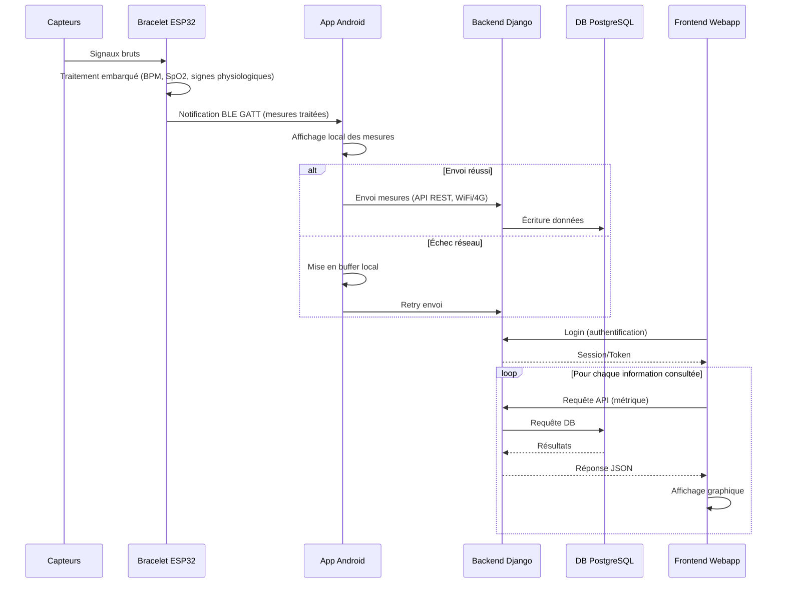

# Documentation — Bracelet Connecté Open Source

**PDG 2026**

**Groupe 9 :** R. Bouzourène, L. Haye, D. Kury & T. Nguyen
**Date :** 01 septembre 2026

---

## Documents utiles

| Page | Description |
|:-------|:-------------|
| [CONTRIBUTING.md](CONTRIBUTING.md) | Instructions de contribution au projet |
| [DEPLOY_FEATURE.md](DEPLOY_FEATURE.md) | Comment développer et livrer une nouvelle fonctionnalité |
| [DEPLOY_LOCAL.md](DEPLOY_LOCAL.md) | Comment faire tourner le projet sur sa machine |

> TODO : Les deux derniers liens sont à compléter une fois les documents rédigés.

---

## Présentation des repos du projet

### Dépôts actifs

| Repo | Description |
|:-------|:-------------|
| [hardware](https://github.com/PDGGRP9/hardware) | Documentation technique concernant tous les composants nécessaires à la réalisation du dispositif |
| [firmware](https://github.com/PDGGRP9/firmware) | Documentation du code embarqué du bracelet |
| [webapp-frontend](https://github.com/PDGGRP9/webapp-frontend) | Documentation du frontend de l'application, écrite en React TypeScript |
| [webapp-backend](https://github.com/PDGGRP9/webapp-backend) | Documentation du backend de l'application, exposant les routes API consommées par les applications Android et web. Implémenté en Django |
| [webapp-app-android](https://github.com/PDGGRP9/webapp-app-android) | Documentation de l'application Android, implémentée en Kotlin |
| [landing-page](https://github.com/PDGGRP9/landing-page) | Landing page et mockups de l'application |

### Dépôts archivés / supprimés TODO

| Repo | Statut |
|:-------|:-------------|
| [gatt-server-emulation]() | Déprécié |
| [ios-app](https://github.com/PDGGRP9/ios-app) | Supprimé |
| [infra-orchestrator](https://github.com/PDGGRP9/infra-orchestrator) | Déprécié |
| [infra-db](https://github.com/PDGGRP9/infra-db) | Déprécié |
| [infra-broker](https://github.com/PDGGRP9/infra-broker) | Déprécié |
| [infra-bridge](https://github.com/PDGGRP9/infra-bridge) | Déprécié |
| [Bracelet_connecte](https://github.com/PDGGRP9/Bracelet_connecte) | Supprimé — premier repo général du projet |

---

## Description du problème et de la solution

### Le problème

Les objets connectés de suivi physiologique aujourd'hui disponibles imposent souvent
des compromis à l'utilisateur : matériel propriétaire fermé qu'il est impossible
d'ouvrir ou d'adapter, abonnements payants pour accéder à ses propres mesures, données
personnelles peu maîtrisées (pas d'export simple, pas de garantie de suppression). Au
global, l'utilisateur n'a que peu de contrôle réel sur les données qu'il génère
lui-même.

### La solution

Nous proposons un bracelet connecté **entièrement open source** — matériel, firmware,
backend et applications — avec un déploiement pensé pour rester accessible à des
particuliers, sans dépendre d'un service propriétaire ni d'un abonnement.

### À qui s'adresse-t-il

Toute personne souhaitant suivre ses constantes physiologiques au quotidien (sportifs,
curieux, profil « quantified self »), sans dépendre d'un matériel propriétaire fermé
ni d'un abonnement payant pour accéder à ses propres données.

### Qu'est-ce que c'est précisément ?

Un bracelet connecté sans écran, porté au poignet, qui mesure en continu des signaux
physiologiques et d'activité de son porteur : rythme cardiaque, oxymétrie (SpO2) et
nombre de pas. Le bracelet ne fait qu'acquérir et transmettre les données. Toute la
visualisation se fait sur une application déployée sur Android ou dans la webapp d'un
navigateur.

Le produit se compose de trois parties :

- **Le bracelet** : capte les signaux bruts, les traite localement et les envoie en
  BLE au téléphone.
- **L'application Android** : reçoit les données depuis le bracelet et les stocke dans
  une base de données. Elle permet également à l'utilisateur de visionner ses données
  (BPM, SpO2, pas) sous forme de courbes, avec une échelle de 24 h à 7 jours
  d'historique.
- **La webapp** : possède les mêmes fonctionnalités de visionnage que l'application
  Android. Affiche au travers de graphiques les données de l'utilisateur.

### Ce que le produit fait concrètement

- Il se porte au poignet en continu, sans nécessiter d'action de l'utilisateur.
- Il mesure en continu le rythme cardiaque et la saturation en oxygène du sang via un
  capteur optique posé contre la peau.
- Il détecte les mouvements du poignet pour compter les pas.
- Il envoie ces données par BLE GATT, à intervalle régulier (quelques secondes), vers
  le téléphone.
- L'utilisateur peut mettre le bracelet en veille profonde via un bouton.
- L'utilisateur consulte, en direct ou en différé, son rythme cardiaque, sa saturation
  en oxygène et son nombre de pas, ainsi que l'historique de ces mesures, depuis
  l'application Android ou la webapp.
- L'application est connectée à un serveur qui stocke ces données.
- L'utilisateur garde la main sur ses données : il peut les consulter, les exporter, ou
  les supprimer.

### Ce que voit et peut faire l'utilisateur (Android/Webapp)

- Se connecter à son compte.
- Voir en direct son rythme cardiaque, son oxymétrie ainsi que le nombre de pas
  accumulés chaque jour.
- Consulter l'historique de ses mesures à travers l'app web/Android sur une
  temporalité de 24 h ou 7 jours.
- Exporter l'entièreté de ses données en JSON/CSV.
- Supprimer ses données utilisateur à tout moment.
- Changer son mot de passe.

### Requirements fonctionnels

- Captation continue des données brutes via le capteur PPG et le capteur IMU.
- Transmission périodique et fiable des mesures vers le serveur.
- Visualisation des données et de l'historique sur l'app et la webapp.
- Contrôle utilisateur des données : consultation, export, suppression, consentement.

### Requirements non-fonctionnels

- **Performance** : latence cible inférieure à 5 s entre mesure et affichage.
- **Fiabilité** : tolérance aux pertes réseau ponctuelles et à l'absence de connexion
  au téléphone.
- **Sécurité** : chiffrement et séparation des données sensibles.
- **Confidentialité** : minimisation des données et traitement local quand possible.
- **Open source** : matériel, logiciel et données ouverts et portables.

### Problématique

Le projet doit résoudre plusieurs contraintes en même temps. Il faut assurer une
communication fiable entre le matériel et le serveur, malgré les limitations des
composants embarqués. Il faut aussi garantir la protection des données, notamment
vis-à-vis du RGPD, tout en permettant un accès simple au site web et à la
visualisation des données.

Un autre enjeu important concerne l'appairage entre le bracelet et le compte
utilisateur, puis la transmission des données physiologiques. Le bracelet peut être utilisé sans que le téléphone soit à proximité, par exemple lors d'une course sans son téléphone. Se pose alors la question de la continuité de la collecte et de l'intégrité des données lorsque le lien avec l'application est interrompu. Par ailleurs, les données physiologiques doivent être accessibles avec une latence réduite afin de rester utiles pour le suivi en direct via l'application.

Et finalement, il faudra correctement gérer l'autonomie du bracelet. Alimenté par une petite batterie, l'ESP32 ne pourra pas tourner à plein régime de manière continue sous peine de la voir s'effondrer.

### Solution proposée

La solution retenue repose sur une communication BLE (GATT) entre le bracelet et une
application Android afin d'acheminer les données de manière régulière. Une librairie
embarquée traite une partie des mesures localement pour réduire le volume de données
transmises et limiter la fréquence des envois.

La chaîne de communication est sécurisée et les données sont pseudo-anonymisées.
L'application Android relaie ensuite ces données vers un backend via une API REST,
permettant leur stockage et leur mise à disposition. Une webapp, composée d'un backend
et d'un frontend, permet la consultation et la visualisation des données, en
complément de l'application Android. Chaque firmware possède également un identifiant
unique pour faciliter l'appairage BLE avec le téléphone. Une latence de quelques
secondes reste acceptable dans ce contexte.

Les choix techniques s'orientent vers un firmware pour ESP32, avec des librairies de
traitement embarqué et le framework Arduino via PlatformIO. Pour assurer la persistance des données, ces dernières sont sauvegardée en flash, ce qui assure une resistance au arrêt et mise en veille. 

Côté mobile, une
application Android implémentée en Kotlin assure la connexion BLE GATT avec le
bracelet, l'affichage local des mesures, ainsi que leur transmission au serveur. À chaque nouvelle connexion, le bracelet synchronise avec l'application toutes les données accumulées pendant la période de déconnexion.

L'infrastructure repose sur un backend en Django et un frontend en React TypeScript.
Le projet utilise GitHub et GitHub Actions pour l'intégration continue, Docker pour
conteneuriser les services et PostgreSQL pour la base de données.

Le protocole de communication entre le bracelet et l'application Android est BLE GATT,
tandis que la communication entre l'application Android et le backend s'effectue via
une API REST sécurisée (HTTPS).

### Limitations connues et pistes d'améliorations

Le projet reste un prototype, et certains points restent à consolider avant un usage réel.

**software**
La persistance des données côté serveur présente encore des cas instables à corriger, et plusieurs briques liées à la gestion de compte manquent encore : un serveur mail pour la réinitialisation du mot de passe, l'authentification à deux facteurs (2FA), et une connexion SSO. 

**hardware**
Utilisation d'un chip plus adapté à du BLE et passage des calcul du côté du serveur ?

**firmware**
- Amélioration de la gestion de la batterie en applicant une meilleur gestion des états de veille, nottamment en mettant le device sur pause lorsque l'IMU ne bouge pas ou que le capteur cardiaque retourne des -1 (il n'est donc pas porté...)
- Amélioration de la mesure sur le capteur cardique, la fenetre est problablemetn trop courte pour avoir des mesures fiables

### Composition du bracelet (TODO : à enlever ? ca alourdit la page, et on devine bien que c'est documenté dans la page hardware ? + les composant sont déjà décrits dans le fonctionnement technique ci dessous !)

| Composant | Fonction dans le produit |
|-----------|---------------------------|
| **XIAO ESP32S3** | Cerveau du bracelet : lit les capteurs, traite le signal et envoie les données en BLE |
| **SEN0344 (DFRobot)** | Capteur optique posé contre la peau du poignet, utilisé pour mesurer le rythme cardiaque et l'oxymétrie (SpO2) |
| **SEN0142 (DFRobot)** | Accéléromètre, détecte les mouvements du poignet pour le comptage de pas |
| **Batterie Lipo** | Alimentation autonome du bracelet |
| **Bouton poussoir** | Mise en veille et allumage du dispositif |
| **LED** | Indicateur visuel d'état |

La liste détaillée des composants, des schémas et de la modélisation du dispositif est
disponible dans le dépôt [hardware](https://github.com/PDGGRP9/hardware).

> **Note sur le choix de connectivité :** Dans un premier temps, le Wi-Fi a été retenu
> pour cette version du prototype car il s'agit d'une technologie plus simple à mettre
> en place, nécessitant moins de connaissances spécifiques et facilitant l'intégration
> avec le broker et la webapp. Ce choix a notamment permis de limiter la complexité de
> développement dans le cadre du temps imparti au projet, une solution BLE ayant
> initialement semblé demander un développement d'application Android trop conséquent
> pour être réalisé dans les délais.
>
> Finalement, compte tenu du temps disponible, nous avons pu implémenter une
> application Android se connectant en BLE GATT, avec un affichage des données à la
> fois via l'application Android et via la webapp.
>
> Pour un usage réel en tant que bracelet porté au quotidien, le BLE reste néanmoins
> la technologie la plus adaptée : elle consomme beaucoup moins d'énergie que le
> Wi-Fi, ce qui permettrait d'augmenter significativement l'autonomie de la batterie,
> un critère que nous avons jugé essentiel pour un dispositif porté en continu.

---

## Fonctionnement technique du produit, étape par étape

1. **Le capteur cardiaque et d'oxymétrie (SEN0344)** mesure le signal brut du flux
   sanguin au niveau du poignet.
2. **L'accéléromètre (SEN0142)** détecte les mouvements du bras, ce qui permet de
   compter les pas et d'aider à distinguer un vrai battement de cœur d'un artefact dû
   au mouvement.
3. **La carte ESP32S3** reçoit les données brutes, les traite, calcule le rythme
   cardiaque (BPM) et la SpO2, et expose régulièrement ce paquet de données via un
   service BLE GATT. TODO : expliqué la peristance des données ?
4. **L'application Android**, connectée en BLE au bracelet, reçoit ces données, les
   affiche localement à l'utilisateur, et les transmet à un serveur backend via une
   connexion HTTPS.
5. **Le serveur backend** reçoit les données envoyées par l'application Android, les
   valide et les enregistre dans une base de données PostgreSQL.
6. **La webapp et l'application Android**, connectées au même backend, affichent à
   l'utilisateur, en quasi temps réel, son rythme cardiaque, son oxymétrie et son
   nombre de pas, avec la possibilité de consulter l'historique.

---

## Architecture et flux de données

### Architecture du système

### Diagramme de séquence

